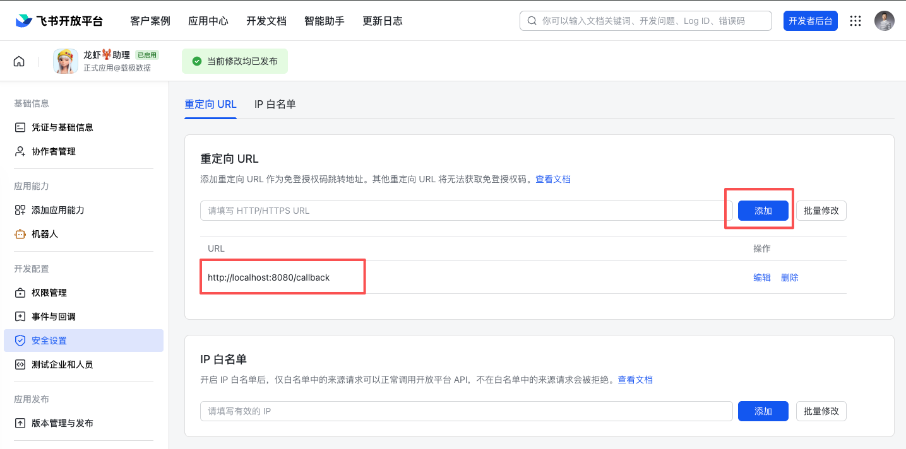
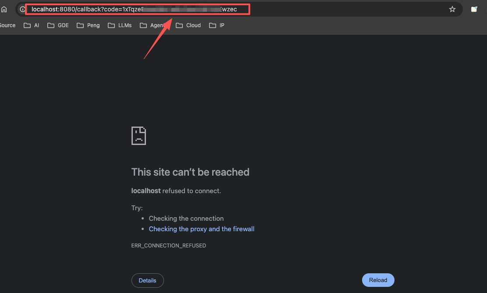

# 第 13 节 实验手册：全自动财务填报与跨系统数据搬运机器人

> 配套课程：AI 业务流架构师 · 第 13 节《全自动财务填报与跨系统数据搬运机器人》
> 预计耗时：60–90 分钟（含飞书 OAuth 配置）
> 操作方式：全程在飞书 DM 里和龙虾对话完成，不需要登录服务器
> 前置条件：OpenClaw 已部署 + 飞书已集成（第 2–4 节内容）

---

## 0. 开始前确认

| # | 物料 | 备注 |
|---|---|---|
| 1 | 龙虾可正常对话 | 飞书 DM 发一句话能回复 |
| 2 | 飞书开发者应用 | 有 App ID / App Secret |
| 3 | 飞书多维表格 | 含费用报销表 + 交通报销表（第 4 节已建好即可） |
| 4 | 一张 PDF 发票 | 仓库自带 demo，不用自己准备 |

---

## 1. 部署项目（发给龙虾）

在飞书 DM 里发送以下消息：

```
请帮我初始化 financial-automation 项目环境。

仓库已克隆在 ~/projects/agentic-ai，项目在仓库的 financial-automation/ 子目录。

要求：
1. 在 ~/projects/agentic-ai 执行 git pull，拉取最新代码
2. 进入 financial-automation/ 子目录
3. 创建 Python 虚拟环境 .venv（如已存在跳过）
4. 安装 requirements.txt
5. 从 .env.example 复制出 .env.local（如已存在跳过）

完成后告诉我：
- git pull 是否成功（有无新的提交拉下来）
- 依赖是否安装成功（特别是 rapidocr_onnxruntime）
- .env.local 是否已存在或已创建
```

龙虾完成后你会收到确认。

---

## 2. 创建飞书多维表格（发给龙虾 / 或沿用已有表）

如果你第 4 节已经建好了费用报销表和交通报销表，跳过这步，直接去第三步。

如果需要新建，发送：

```
请帮我在飞书里创建一个用于 Financial Automation 的多维表格。

要求：
1. 新建一个 Bitable
2. 创建两张表：费用报销表 + 交通报销表
3. "票据附件"必须是真正的附件字段，不能是文本字段

费用报销表字段：
doc_id、报销类型、源文件名、票据附件、票据号码、开票日期、金额、币种、购买方名称、购买方税号、销售方名称、销售方税号、项目名称、数量、单价、项目金额、税率、税额、校验状态、是否复核、复核原因

交通报销表字段：
doc_id、报销类型、源文件名、票据附件、票据号码、金额、币种、购票主体、购票主体税号、乘车人、车次、出发站、到达站、乘车日期、发车时间、座位号、座席、校验状态、是否复核、复核原因

创建完成后请给我：
1. FEISHU_BITABLE_APP_TOKEN=
2. FEISHU_BITABLE_EXPENSE_TABLE=
3. FEISHU_BITABLE_TRANSPORT_TABLE=
```

龙虾会返回三个值，记下来。

---

## 3. 填写环境配置（发给龙虾）

> **⚠️ 发送前先自己填好真实值，不要把占位符发出去。**
> - `FEISHU_APP_ID` / `FEISHU_APP_SECRET`：飞书开放平台 → 应用详情页获取
> - `FEISHU_BITABLE_APP_TOKEN` / `FEISHU_BITABLE_TRANSPORT_TABLE` / `FEISHU_BITABLE_EXPENSE_TABLE`：第 2 步龙虾已返回；如跳过了第 2 步，从 Bitable URL 中提取（`/base/` 后是 APP_TOKEN，`?table=` 后是表 ID，不要带 `&view=...`）

把你的真实值替换进去，发送：

```
请把 ~/projects/agentic-ai/financial-automation/.env.local 配成：

FEISHU_APP_ID=cli_xxxxxxxx
FEISHU_APP_SECRET=xxxxxxxx
FEISHU_BITABLE_APP_TOKEN=xxxxxxxx
FEISHU_BITABLE_TRANSPORT_TABLE=tblxxxxxxxx
FEISHU_BITABLE_EXPENSE_TABLE=tblxxxxxxxx
```

---

## 4. 本地识别验证（发给龙虾）

```
请用 financial-automation 项目跑一次本地识别测试。

用仓库自带的 demo 票据 runtime/sample_run_input/hotel_invoice.pdf 执行：
- 进入项目目录
- 加载 .env.local
- 调用 scripts/run_skill_job.py 处理这张 PDF

执行完后告诉我：
1. 是否生成了 documents（结构化票据数据）
2. 是否生成了 review_queue（复核队列）
3. 是否生成了 bitable_write_plan（写表计划）
4. 识别出了哪些关键字段（金额、日期、票据号）
```

> **⚠️ 注意**：龙虾返回 `bitable_write_plan` **不代表完成**，这只是中间产物，真正写表在第 6 步。确认 `documents` 和 `bitable_write_plan` 都有内容即可继续。

再跑第二张票：

```
请继续用 runtime/sample_run_input/icic_invoice.pdf 跑一次识别，确认交通票也能正确识别。
```

---

## 5. 飞书 OAuth 授权

### 5.1 配置重定向地址（手动，一次性）

1. 打开 https://open.feishu.cn/ → 开发者后台 → 选择**龙虾对话所在的飞书应用**
2. 进入「安全设置」→「重定向 URL」
3. 添加：`http://localhost:8080/callback`
4. 点击保存，确认显示「当前修改均已发布」



> 只需要配置一次，之后不用重复操作。注意要选对应用，用的是龙虾（OpenClaw）所在的那个飞书应用，不是其他应用。

### 5.2 获取授权链接（发给龙虾）

```
请根据 ~/projects/agentic-ai/financial-automation/.env.local 里的 FEISHU_APP_ID，
帮我生成飞书 OAuth 授权链接：

redirect_uri 使用：http://localhost:8080/callback

注意：redirect_uri 不要 URL 编码，直接用明文，方便我复制到浏览器。
```

龙虾会返回授权链接。**不要在飞书里直接点击**，复制链接后粘贴到浏览器地址栏打开（飞书聊天会对链接二次处理导致参数错误）。完成飞书登录授权后，浏览器会跳转到：

```
http://localhost:8080/callback?code=XXXXXX
```

浏览器显示无法访问是正常的（本地没有监听 8080 端口），但地址栏里已经有 `code=` 参数，直接从地址栏复制即可。



复制 `code=` 后面的值（到末尾或下一个 `&` 之前）。

### 5.3 换 token（发给龙虾）

```
请用这个 OAuth code 换取飞书用户 token：

code: 你复制的code

执行 financial-automation 项目的 scripts/get_user_access_token.py --code '上面的code'

完成后告诉我：
1. runtime/oauth/feishu_user_token.json 是否已生成
2. 里面有没有 access_token 和 refresh_token
```

### 5.4 后续刷新（token 过期时）

```
请刷新 financial-automation 项目的飞书用户 token（不需要 code，直接用 refresh_token 续期）。
```

---

## 6. 真附件落表验证（发给龙虾）

```
请用 financial-automation 项目重新处理 hotel_invoice.pdf，这次要走完整链路：

1. 跑识别
2. 真实上传附件到 Bitable attachment context
3. 真实 create/update 写入飞书多维表格
4. 回读确认

请重点告诉我：
1. attachment_upload_result.ok 是否为 true
2. 票据附件字段是否拿到了真实 file_token
3. 是写入了费用报销表还是交通报销表
4. 能不能从表里回读到这条记录

如果失败，告诉我失败在 OAuth、附件上传、还是写表哪个阶段。
```

写入成功后，打开飞书多维表格确认。

再跑一张交通票验证交通表：

```
请继续用 icic_invoice.pdf 跑真附件落表，验证交通报销表也能写入成功。
```

---

## 7. 注册 Skill

### 7.1 拉取最新代码（发给龙虾）

```
请在 ~/projects/agentic-ai 执行 git pull，拉取 financial-automation 最新版本。
```

### 7.2 复制 Skill 目录（发给龙虾）

```
请将 financial-expense-automation Skill 目录复制到 OpenClaw 的 skills 目录：

cp -r ~/projects/agentic-ai/financial-automation/skills/financial-expense-automation \
  ~/.openclaw/workspace/skills/financial-expense-automation

完成后确认 ~/.openclaw/workspace/skills/financial-expense-automation/SKILL.md 已存在。
```

### 7.3 配置环境变量（发给龙虾）

```
请在 ~/.openclaw/.env 中添加以下环境变量（文件不存在则新建）：

FINANCIAL_AUTOMATION_ROOT=~/projects/agentic-ai/financial-automation

完成后确认该行已写入文件。
```

### 7.4 验证 Skill 是否生效（发给龙虾）

```
请帮我报销这张票据：
~/projects/agentic-ai/financial-automation/runtime/sample_run_input/icic_invoice.pdf
```

> 如果 Skill 注册成功，龙虾应自动触发 `financial-expense-automation`，走完识别 → 写表 → 回读的完整链路。写表成功即完成第 7 步。

---

## 8. 验收检查清单

- [ ] 龙虾部署项目成功（依赖安装、.env.local 已配置）
- [ ] 本地识别 hotel_invoice.pdf 输出 documents + review_queue + bitable_write_plan
- [ ] 本地识别 icic_invoice.pdf 同上
- [ ] 飞书 OAuth code 换 token 成功
- [ ] 真附件落表成功（attachment_upload_result.ok = true）
- [ ] 飞书多维表格里能看到新记录 + 真附件可点开

---

## 9. 常见问题速查

| 龙虾报的错 | 原因 | 你发什么 |
|---|---|---|
| `ModuleNotFoundError: rapidocr` | 没用虚拟环境 | 「请确认用的是项目的 .venv 环境」 |
| `missing FEISHU_APP_ID` | 没加载 .env.local | 「请先加载 .env.local 再跑」 |
| `Invalid access token` | code 当 token 用了 | 重新拿 code，再发给龙虾换 token |
| `code is expired` | OAuth code 过期 | 重新打开授权链接，拿新 code |
| `parent node not exist` | APP_TOKEN 配错 | 「请检查 .env.local 里的 APP_TOKEN 是不是 /base/ 后面那段」 |
| 附件字段看不到附件 | 用了 Drive 通用 token | 确认用的是最新版代码 |
| 只输出 plan 没有写表 | 缺少 user_access_token | 先完成第五步 OAuth 授权 |

---

## 实验记录

请记录你在实验过程中遇到的任何与预期不符的情况：

| # | 发生在哪一步 | 预期行为 | 实际行为 | 你的解决方法 |
|---|------------|----------|---------|------------|
| 1 | | | | |
| 2 | | | | |
| 3 | | | | |

> 欢迎把你的实验记录和踩坑发现分享到课程社群。
