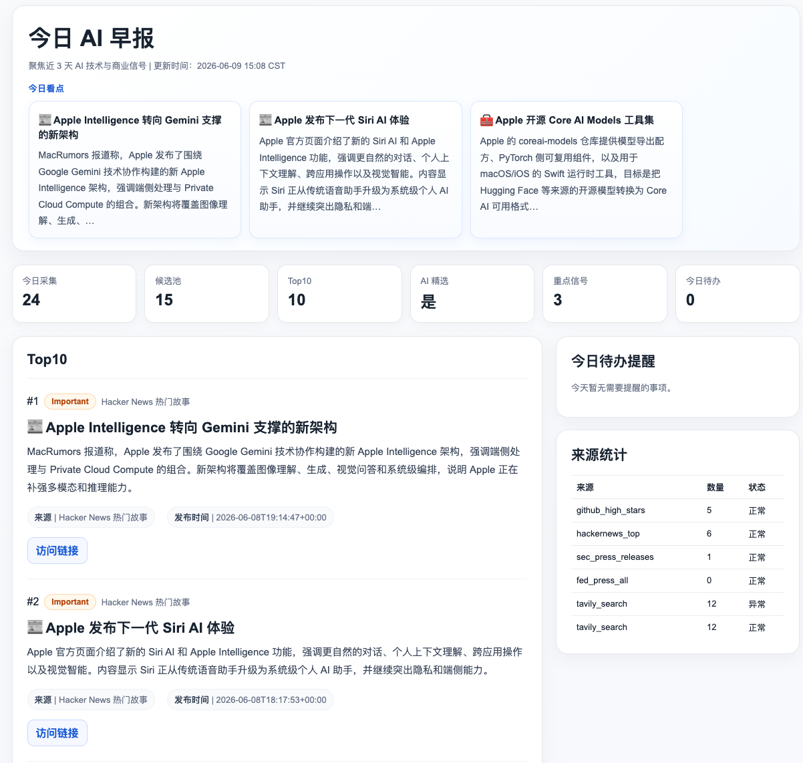

# Morning Newspaper Assistant

> 配套课程：AI 业务流架构师 · 第 14 节《全天候信息分诊防线与多平台智能早报管家》

把 GitHub、Hacker News、RSS、Tavily 搜索和邮箱等异构信号源，经过三道 LLM 编辑关口（标题粗筛 → 中文成稿 → Top10 精排），压缩成每日可交付的 AI 早报页面和飞书推送消息。

```
数据源 (GitHub / HN / Tavily / RSS / 邮箱)
    ↓ 采集与准备（纯脚本）
collected_raw → enrich → title_candidates
    ↓ LLM 关口 1：标题粗筛
    ↓ LLM 关口 2：中文成稿
    ↓ LLM 关口 3：Top10 精排 + 多样性约束
    ↓
dashboard.html ──→ 8510 固定链接 + 飞书推送
```

> 完整架构说明见 [docs/architecture.md](docs/architecture.md)



## 与课程的关系

本项目是第 14 节的实战代码，服务于课程的三个核心留存物：

| 留存物 | 在本项目中的体现 |
|---|---|
| **信号分诊而非摘要** | 100+ 原始候选 → 15 条编辑候选池 → 10 条 Top10 资讯 + N 条紧急事务，资讯流与事务流分离交付 |
| **三种采集范式** | 结构化 API（GitHub Search API）/ 动态搜索回填（Tavily 搜索计划）/ 私有状态读取（IMAP 邮箱事件队列） |
| **LLM 任务拆分方法** | 三道关口各自只做一件事——粗筛只看标题、成稿才读正文、精排不重新写稿；每个产物可独立检查、独立重跑 |

## 前置条件

| 条件 | 说明 |
|---|---|
| Python 3.10+ | 代码使用了 `X \| Y` 联合类型等 3.10 语法 |
| OpenClaw 已部署 | 龙虾正常对话，用于三道 LLM 关口和 Tavily 搜索 Skill |
| Tavily API Key（推荐） | 在 [tavily.com](https://tavily.com) 注册获取，用于动态搜索回填采集 |
| GitHub Token（可选） | 不配置可跑，但 GitHub API 匿名速率较低 |
| IMAP 邮箱授权码（可选） | 不配置自动跳过邮箱提醒，不影响主流程 |

## 快速开始

分三步递进——环境准备、单步采集验证、完整流水线。跑通前两步即可掌握本节 80% 的内容。

### 第一步：环境准备

```bash
cd morning-newspaper
python3 -m venv .venv
source .venv/bin/activate
pip install -r requirements.txt
cp .env.example .env
# 编辑 .env，按需填入 GITHUB_TOKEN 和邮箱授权码
```

### 第二步：单步采集验证

```bash
# 查看采集计划（不请求网络，确认配置正确）
python scripts/collect_raw.py --dry-run

# 实际采集（GitHub、HN、RSS 无需额外配置即可运行）
python scripts/collect_raw.py --skip-tavily

# 正文抓取
python scripts/enrich_content.py
```

采集完成后检查 `runtime/collected_raw.json`，应看到来自 GitHub、Hacker News、RSS 的真实候选条目。`--skip-tavily` 跳过需要 OpenClaw Skill 的 Tavily 搜索，方便本地独立验证。

### 第三步：完整流水线

```bash
python scripts/run_daily_pipeline.py
```

流水线按七步顺序执行。前三步（采集、正文抓取、准备粗筛输入）完成后，脚本会检查三个 LLM 回填文件是否存在：

- `runtime/title_shortlist_result.json`（标题粗筛结果）
- `runtime/draft_result.json`（中文成稿结果）
- `runtime/top10_ranking_result.json`（Top10 精排结果）

这三个文件由 OpenClaw 在执行 Skill 时按三个 LLM 关口逐步生成。如果缺失，脚本报错并指出缺少哪一步，不会静默跳过。每个 apply 脚本还会校验结果文件的修改时间（mtime）是否晚于输入文件，防止上一轮遗留的旧结果串入当前流程。

所有中间产物和 LLM 结果文件统一存放在 `runtime/` 目录。完整的执行流程参见 `SKILL.md` 和 `lesson14-lab.md` 实验手册。

## 核心模块

| 模块 | 职责 |
|---|---|
| `config/sources.yaml` | 所有信号源配置：GitHub、HN、RSS、Tavily 主题、邮箱、运行时间窗口 |
| `src/morning_newspaper/collectors/` | 各来源采集器：`github.py`、`hackernews.py`、`rss.py`、`tavily.py` |
| `src/morning_newspaper/content_fetch.py` | 正文二次抓取、主体抽取、网页噪音过滤 |
| `src/morning_newspaper/mailbox.py` | IMAP/POP3 邮箱采集、事件队列、到期触发 |
| `src/morning_newspaper/dashboard.py` | 看板 payload 组装与静态 HTML 渲染 |
| `scripts/collect_raw.py` | 多源候选采集入口，写 `collected_raw.json` |
| `scripts/enrich_content.py` | 正文抓取，写 `content_enriched.json` |
| `scripts/prepare_*.py` | 为三道 LLM 关口准备输入和 prompt |
| `scripts/apply_*.py` | 应用 LLM/人工回填结果，推进流水线 |
| `scripts/build_dashboard.py` | 生成 `runtime/dashboard.html` 静态页面 |
| `scripts/run_daily_pipeline.py` | 每日自动运行主流程入口 |
| `skills/.../SKILL.md` | OpenClaw Skill 入口契约（Agent 调度器接口） |

## 流水线与数据产物

七个产物接力构成完整链路——每一步只消费上一步的约定文件，不跳步、不静默 fallback：

| 步骤 | 产物文件 | 说明 |
|---|---|---|
| 1. 多源采集 | `runtime/collected_raw.json` | 统一格式的原始候选池 |
| 2. 正文抓取 | `runtime/content_enriched.json` | 补正文、抓取状态、正文长度 |
| 3. 标题粗筛 | `runtime/title_shortlist_result.json` | LLM 关口 1：保留 10-15 条相关标题 |
| 4. 中文成稿 | `runtime/draft_result.json` | LLM 关口 2：生成中文标题和摘要 |
| 5. Top10 精排 | `runtime/top10_ranking_result.json` | LLM 关口 3：最终排序 |
| 6. 发布层 | `runtime/top10_publishable.json` | 页面只读取这个文件 |
| 7. 页面生成 | `runtime/dashboard.html` | 可直接打开的静态早报页面 |

说明：`Top10` 是发布层的目标上限，不是硬性凑数目标。如果某一轮真正符合主题和质量要求的候选不足 10 条，应按实际 `publishable` 条数交付，不要为了凑满 10 条引入明显偏题、重复或低质量内容。

邮箱侧链独立运行，产物为 `runtime/executive_mailbox.json`（紧急事务卡片）和 `runtime/mail_event_queue.json`（未来事项队列），不参与 Top10 排序。

## 三种采集范式

| 范式 | 代表来源 | 核心特征 |
|---|---|---|
| 结构化 API | GitHub Search API、HN Firebase API | 先定义目标画像（stars/language/topic），再用官方接口查询 |
| 动态搜索回填 | Tavily 搜索 | 先写搜索计划（`tavily_search_plan.json`），直接调用 Tavily REST API 执行搜索 |
| 私有状态读取 | 邮箱 IMAP/POP3（以 163 为例） | 维护事件队列，到期才触发——不是抓内容，是读状态 |

看到不同来源，先判断该用哪种采集范式——这是课程传递的第一个方法论。

## 三道 LLM 编辑关口

| 关口 | 输入粒度 | 做什么 | 不做什么 |
|---|---|---|---|
| 标题粗筛 | 只看标题 | 选出 10-15 条值得读正文的候选 | 不读正文、不打分 |
| 中文成稿 | 标题 + 正文前 1800 字 | 写中文标题和 2-3 句摘要 | 不再筛选、不写审稿意见 |
| Top10 精排 | 已成稿候选 | 决定谁进前 10 和先后顺序 | 不重新写稿 |

核心约束：每个关口只做一件事，产物可独立检查、独立重跑。

## Tavily 搜索配置

Tavily 是早报的动态搜索回填来源，采集脚本直接调用 Tavily REST API 执行搜索。在 `.env` 中配置 API Key：

```bash
TAVILY_API_KEY=tvly-your_tavily_api_key
```

> API Key 在 [tavily.com](https://tavily.com) 注册后获取，免费额度足够日常早报使用。

搜索主题在 `config/sources.yaml` 的 `tavily_search.topics` 段配置，每个主题包含搜索词和域名白名单：

```yaml
topics:
  - id: ai_frontier_technology
    name: AI 前沿技术
    query: latest AI model release multimodal reasoning inference benchmark
    domains: [openai.com, anthropic.com, deepmind.google, ai.meta.com]
```

不配置 `TAVILY_API_KEY` 时，采集脚本仍可正常运行（GitHub、HN、RSS 不受影响），但 Tavily 搜索结果为空。

## GitHub Token 配置

GitHub 采集器通过 Search API 查询高星仓库。不配置 Token 也能运行，但匿名请求限制为每分钟 10 次，配置后提升到每分钟 30 次。

获取步骤：

1. 登录 GitHub → 点击右上角头像 → **Settings**
2. 左侧栏最底部 → **Developer settings** → **Personal access tokens** → **Fine-grained tokens**
3. 点击 **Generate new token**，填写 Token 名称（如 `morning-newspaper`），过期时间建议 90 天
4. **Repository access** 选 **Public Repositories (read-only)**，无需勾选额外权限
5. 点击 **Generate token**，复制生成的 `github_pat_...` 字符串

在 `.env` 中配置：

```bash
GITHUB_TOKEN=github_pat_your_token_here
```

> Classic Token（`ghp_` 开头）同样可用，创建时勾选 `public_repo` 权限即可。

## 邮箱提醒配置

邮箱采集用于早报的"紧急事务侧栏"，不参与资讯 Top10 排序。支持任何提供 IMAP/POP3 服务的邮箱（163、QQ、Gmail、Outlook 等），课程以 163 邮箱为例演示。

```bash
cp .env.example .env
# 编辑 .env，填入真实的 IMAP_USER 和 IMAP_PASS
```

> `IMAP_PASS` 使用邮箱后台生成的客户端授权码 / 应用专用密码，不是网页登录密码。

邮箱服务器地址在 `config/sources.yaml` 的 `assistant_mailbox` 段配置，默认为 163 邮箱（`imap.163.com:993`）。使用其他邮箱时只需修改 `host` 和 `port`：

| 邮箱 | IMAP 地址 | 端口 |
|---|---|---|
| 163 | `imap.163.com` | 993 |
| QQ | `imap.qq.com` | 993 |
| Gmail | `imap.gmail.com` | 993 |
| Outlook | `outlook.office365.com` | 993 |

不需要邮箱提醒时无需创建 `.env`，系统会自动跳过邮件源。

## 主题切换

要把早报主题从 AI 换成其他领域（商业 / 金融 / 出海），只需编辑 `config/sources.yaml` 中的 Tavily 搜索主题配置：

```yaml
# 改这三个字段即可，流程代码不用动
topics:
  - id: business_market_intel
    name: 商业财报与资本动作
    query: earnings acquisition macro enterprise SW
    domains: [reuters.com, bloomberg.com, ft.com, wsj.com]
```

## 自动交付

从"能跑一次"到"每天到达"需要四件事：

1. **接入入口** — SKILL.md 让整个流水线可被 OpenClaw 触发
2. **固定页面** — `dashboard.html` 通过 `serve_dashboard_8510.sh` 挂到公网
3. **每日自动生成** — 07:55 Cron 创建隔离 OpenClaw Session，执行完整流水线（含 3 个 LLM 关口）
4. **分级推送** — 07:58 向飞书日报群发执行回执，08:05 发正式早报摘要或失败告警

> 详细的调度架构和防护机制见 [docs/architecture.md](docs/architecture.md)

## 完成标准

一次完整成功必须同时满足：

1. `runtime/top10_publishable.json` 存在且 count > 0；若高质量候选不足 10 条，允许按实际 publishable 条数交付
2. `runtime/dashboard.html` 已更新，无 `[TEST]` 占位摘要
3. `scripts/check_runtime_status.py` 通过
4. 页面服务监听 `0.0.0.0:8510`，公网可访问
5. 飞书群收到包含前三条标题和摘要的早报消息

## 目录结构

```
morning-newspaper/
├── config/
│   └── sources.yaml                         # 信号源配置：GitHub/HN/RSS/Tavily/邮箱
├── docs/
│   ├── architecture.md                      # 系统架构：数据源、流水线、调度、防护机制
│   ├── source_strategy.md                   # 信息源策略：三种采集范式、配置、数据模型
│   └── screenshots/
│       └── dashboard-demo.png               # 早报 Dashboard 运行效果截图
├── references/
│   └── editorial_rules.md                   # 编辑规则、筛选口径、成稿风格参考
├── scripts/
│   ├── collect_raw.py                       # 多源候选采集
│   ├── collect_mailbox.py                   # 邮箱提醒采集
│   ├── enrich_content.py                    # 正文抓取与噪音清洗
│   ├── prepare_title_shortlist.py           # 准备标题粗筛输入
│   ├── apply_title_shortlist.py             # 应用粗筛结果
│   ├── prepare_draft_input.py               # 准备中文成稿输入
│   ├── apply_draft_results.py               # 应用成稿结果
│   ├── prepare_top10_ranking.py             # 准备 Top10 精排输入
│   ├── apply_top10_ranking.py               # 应用精排结果
│   ├── build_dashboard.py                   # 生成静态 HTML 看板
│   ├── run_daily_pipeline.py                # 每日自动运行入口
│   ├── check_runtime_status.py              # 产物完整性与质量检查
│   ├── run_tavily_plan.py                   # Tavily 搜索计划衔接
│   ├── serve_dashboard_8510.sh              # 8510 Web 服务启停脚本
│   └── dashboard_app.py                     # Streamlit 动态看板（本地调试用）
├── skills/
│   └── morning-newspaper-assistant-skill/
│       ├── SKILL.md                         # OpenClaw Skill 入口契约
│       └── scripts/
│           └── run_morning_report.py     # 一键编排入口
├── src/
│   └── morning_newspaper/
│       ├── collectors/                      # 各来源采集器
│       │   ├── orchestrator.py              #   统一调度、时间窗口过滤、去重
│       │   ├── github.py                    #   GitHub Search API
│       │   ├── hackernews.py                #   HN Firebase API
│       │   ├── rss.py                       #   RSS/Atom 解析
│       │   ├── tavily.py                    #   Tavily 搜索计划 + 结果读取
│       │   └── items.py                     #   RawItem 构造与去重
│       ├── common.py                        # JSON/YAML/.env/HTTP 通用函数
│       ├── content_fetch.py                 # 正文抓取与主体抽取
│       ├── dashboard.py                     # 看板 payload 与 HTML 渲染
│       ├── mailbox.py                       # IMAP/POP3 邮箱采集与事件识别
│       └── models.py                        # RawItem 数据模型
├── .env.example                             # 环境变量模板（邮箱 + GitHub Token）
├── lesson14-lab.md                          # 第 14 节实验手册
├── requirements.txt                         # Python 依赖
└── README.md
```

## 相关课程章节

| 前置 | 内容 |
|---|---|
| 第 6 节 | 心跳引擎与定时任务（Cron + Heartbeat 基础） |
| 第 9 节 | SKILL.md 规范与自定义 Skill 开发 |
| 第 13 节 | 五步拆解心法与完成态公式（本节延续同一框架） |

| 后续 | 复用 |
|---|---|
| 第 15 节 | 信号分诊 + 三关口编辑 → CRM 跟进 |
| 第 18 节 | 信号分诊 + 三关口编辑 → 量化投研 |
