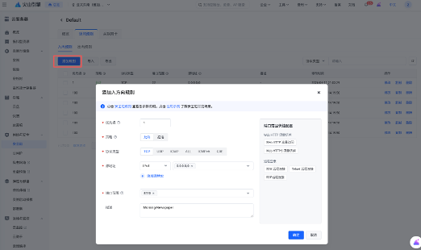

# 第 14 节 实验手册：全天候信息分诊防线与多平台智能早报管家

> 配套课程：AI 业务流架构师 · 第 14 节《全天候信息分诊防线与多平台智能早报管家》
> 预计耗时：45–75 分钟（含云服务器端口配置）
> 操作方式：全程在飞书 DM 里和龙虾对话完成，云控制台端口放行需要手动操作
> 前置条件：OpenClaw 已部署 + 飞书已集成（第 2–4 节内容）

---

## 0. 开始前确认

| # | 物料 | 备注 |
|---|---|---|
| 1 | 龙虾可正常对话 | 飞书 DM 发一句话能回复 |
| 2 | 课程仓库已 clone | `~/projects/agentic-ai` 存在且可 `git pull` |
| 3 | 云服务器 | 项目目录为 `~/projects/agentic-ai/morning-newspaper` |
| 4 | 火山云控制台权限 | 用于放行早报页面端口 `8510` |
| 5 | GitHub Token（可选） | 提升 GitHub API 速率，获取方式见 README |
| 6 | Tavily API Key（推荐） | 在 [tavily.com](https://tavily.com) 注册获取 |
| 7 | 邮箱授权信息（可选） | 如需接入邮箱提醒，准备 `IMAP_USER` / `IMAP_PASS` |

---

## 1. 部署项目（发给龙虾）

在飞书 DM 里发送以下消息：

```text
请帮我初始化 morning-newspaper 项目环境。

仓库已克隆在 ~/projects/agentic-ai，项目在仓库的 morning-newspaper/ 子目录。

要求：
1. 在 ~/projects/agentic-ai 执行 git pull，拉取最新代码
2. 进入 morning-newspaper/ 子目录
3. 创建 Python 虚拟环境 .venv（如已存在跳过）
4. 安装 requirements.txt
5. 从 .env.example 复制出 .env（如已存在跳过）

完成后告诉我：
- git pull 是否成功（有无新的提交拉下来）
- 依赖是否安装成功
- .env 是否已存在或已创建
```

龙虾完成后你会收到确认。

---

## 2. 配置环境变量（发给龙虾）

> **⚠️ 发送前先自己填好真实值，不要把占位符发出去。**
> - `GITHUB_TOKEN`：获取步骤见 [README — GitHub Token 配置](README.md#github-token-配置)
> - `TAVILY_API_KEY`：获取步骤见 [README — Tavily 搜索配置](README.md#tavily-搜索配置)
> - `IMAP_USER` / `IMAP_PASS`：获取步骤见 [README — 邮箱提醒配置](README.md#邮箱提醒配置)

把你的真实值替换进去，发送：

```text
请把 ~/projects/agentic-ai/morning-newspaper/.env 配成：

GITHUB_TOKEN=github_pat_xxxxxxxx
TAVILY_API_KEY=tvly-xxxxxxxx
IMAP_USER=你的邮箱地址
IMAP_PASS=你的邮箱授权码

完成后确认：
1. .env 文件已写入
2. 各项变量已配置（不要把完整密钥发出来）
```

> 如果某项不需要，直接从上面删掉对应行即可。不配置 GitHub Token 会受匿名速率限制；不配置 Tavily 会跳过搜索回填；不配置 IMAP 会跳过邮箱提醒。

---

## 3. 采集验证（发给龙虾）

先跑一次单步采集，确认环境和配置无误：

```text
请在 morning-newspaper 项目下运行一次采集验证。

执行：
cd ~/projects/agentic-ai/morning-newspaper
source .venv/bin/activate
python scripts/collect_raw.py --skip-tavily

完成后告诉我：
1. runtime/collected_raw.json 是否生成
2. 采集到了多少条候选
3. 各来源（GitHub、HN、RSS）分别采集了多少条
4. 有没有来源报错
```

> 这一步只验证采集层，`--skip-tavily` 跳过 Tavily 搜索（需要 API Key）。看到 GitHub、HN、RSS 有真实数据即可继续。

---

## 4. 运行完整生成链路（发给龙虾）

```text
请在 morning-newspaper 项目下跑一次完整的早报生成链路。

项目目录：~/projects/agentic-ai/morning-newspaper

要求：
1. 先严格按 Skill 流程运行，产出：
   - runtime/collected_raw.json
   - runtime/content_enriched.json
   - runtime/title_candidates.json
   - runtime/title_shortlist_prompt.txt
2. 然后为本轮输入补齐这 3 个关键结果文件：
   - runtime/title_shortlist_result.json
   - runtime/draft_result.json
   - runtime/top10_ranking_result.json
3. 之后继续 apply 正式链路，生成：
   - runtime/shortlist.json
   - runtime/draft_input.json
   - runtime/drafted_items.json
   - runtime/top10_ranking_input.json
   - runtime/top10_publishable.json
   - runtime/dashboard.html

请不要复用旧的占位结果文件，不要继续使用 [TEST] 占位摘要。
如果 title_shortlist_result.json、draft_result.json、top10_ranking_result.json 没有为当前这一轮输入正确生成，就不要假装正式页面已经完成。

完成后告诉我：
1. runtime/top10_publishable.json 是否存在，count 是否为 10
2. runtime/dashboard.html 是否已更新
3. scripts/check_runtime_status.py 是否通过
4. summary_placeholders 是否为空
```

> 关键判断：不要把"脚本跑成功"误当成"正式早报已经可交付"。必须确认当前这轮输入对应的 shortlist / draft / ranking 结果都已生成，并产出无占位摘要的正式页面。

---

## 5. 云服务器-端口开放配置（手动）

页面链接当前使用：

```text
http://<你的服务器IP>:8510/dashboard.html
```

其中 `8510` 是早报页面端口，需要在云控制台和服务器侧同时放行。

### 5.1 火山云安全组放行

以火山引擎为例，操作路径：**云服务器 ECS → 对应实例 → 安全组 → 入方向规则 → 添加规则**

| 项目 | 填写 |
|---|---|
| 策略 | 允许 |
| 协议类型 | TCP |
| 源地址 | `0.0.0.0/0`，或只允许固定 IP |
| 端口范围 | `8510` |
| 描述 | Morning Newspaper Assistant dashboard |



### 5.2 服务器防火墙放行（可选）

如果服务器启用了 `ufw`，发送给龙虾或自己在服务器执行：

```bash
sudo ufw allow 8510/tcp
```

如果服务器使用 `firewalld`，执行：

```bash
sudo firewall-cmd --permanent --add-port=8510/tcp
sudo firewall-cmd --reload
```

> 多数云服务器默认未启用系统防火墙，安全组放行后即可访问。如果页面打不开再回来检查这一步。

---

## 6. 启动 Morning-Newspaper Web 服务（发给龙虾）

```text
请启动 morning-newspaper 的早报 Web 服务。

执行：
cd ~/projects/agentic-ai/morning-newspaper
./scripts/serve_dashboard_8510.sh

完成后请确认：
1. 服务是否监听 0.0.0.0:8510
2. runtime/dashboard.html 是否存在
3. http://<你的服务器IP>:8510/dashboard.html 是否可以访问
```

如果页面打不开，按顺序排查：

| # | 检查项 |
|---|---|
| 1 | `./scripts/serve_dashboard_8510.sh` 是否执行过 |
| 2 | 静态服务是否正在监听 `0.0.0.0:8510` |
| 3 | 火山云安全组是否放行 `8510` |
| 4 | 服务器本机防火墙是否放行 `8510` |
| 5 | `runtime/dashboard.html` 是否存在 |
| 6 | 页面是否是最新生成时间对应的版本 |

---

## 7. 注册 Skill

### 7.1 拉取最新代码（发给龙虾）

```text
请在 ~/projects/agentic-ai 执行 git pull，拉取 morning-newspaper 最新版本。
```

### 7.2 复制 Skill 目录（发给龙虾）

```text
请将 morning-newspaper-assistant-skill 目录复制到 OpenClaw 的 skills 目录：

cp -r ~/projects/agentic-ai/morning-newspaper/skills/morning-newspaper-assistant-skill \
  ~/.openclaw/workspace/skills/morning-newspaper-assistant-skill

完成后确认 ~/.openclaw/workspace/skills/morning-newspaper-assistant-skill/SKILL.md 已存在。
```

### 7.3 配置环境变量（发给龙虾）

```text
请在 ~/.openclaw/.env 中添加以下环境变量（文件不存在则新建）：

MORNING_NEWSPAPER_ROOT=~/projects/agentic-ai/morning-newspaper

完成后确认该行已写入文件。
```

### 7.4 验证 Skill 是否生效（发给龙虾）

```text
请帮我生成一份今天的 AI 早报。
```

> 如果 Skill 注册成功，龙虾应自动触发 `morning-newspaper-assistant-skill`，走完采集 → 三道 LLM 关口 → 生成页面的完整链路。`runtime/dashboard.html` 已更新即完成第 7 步。

---

## 8. 设置每日定时任务

### 8.1 创建飞书日报群（手动）

07:58 的群回执任务需要一个专属飞书群来接收消息。

1. 在飞书中新建一个群，命名如"AI 日报自动推送"
2. 将龙虾（OpenClaw）拉入该群
3. 在群内发一条消息，让龙虾回复，确认龙虾在群内能正常响应
4. 记下该群的 Session ID（可以让龙虾告诉你当前群的 Session ID）

> 这个群专门用于接收每日自动生成的早报回执和正式摘要，与日常和龙虾的 1:1 对话分开，避免定时任务干扰正常聊天。

### 8.2 配置定时任务（发给龙虾）

> **⚠️ 发送前把 `<群 Session ID>` 替换为上一步获取的真实 Session ID。**

```text
请为 morning-newspaper 设置三个每日定时任务：

1. 每天北京时间 07:55，创建一个隔离 Session 运行完整早报生成流程
   - 按 SKILL.md 三阶段执行（采集 → 三道 LLM 关口 → apply/build/check）
   - 完成后写 runtime/cron_status.json 和 runtime/cron_group_message.txt
   - 不发送消息，只负责生成

2. 每天北京时间 07:58，向飞书日报群（Session ID: <群 Session ID>）发送执行回执
   - 读取 runtime/cron_group_message.txt
   - 发送到指定群，确保群内稳定收到消息

3. 每天北京时间 08:05，向同一个飞书日报群（Session ID: <群 Session ID>）发送正式早报摘要或失败告警
   - 读取 runtime/cron_status.json
   - 成功：发送前三条标题摘要 + 页面链接
   - 失败：发送失败步骤 + 错误摘要

要求：
- 07:55 使用隔离 Session，不干扰正常飞书对话
- 三个任务职责严格分离：生成 / 群回执 / 正式投递
- 失败时也必须发送失败通知

请完成后告诉我：
1. 三个定时任务分别配置了什么
2. 07:55 任务是否使用隔离 Session
3. 07:58 群回执会发到哪个群
4. 08:05 失败通知会包含哪些信息
```

---

## 9. 发送早报消息验证（发给龙虾）

正式产物生成后，发送：

```text
请从今日早报的正式文件读取前三条：

~/projects/agentic-ai/morning-newspaper/runtime/top10_publishable.json

发送前请先确认：
1. runtime/dashboard.html 已更新
2. top10_publishable.json 中 count = 10
3. 页面没有大面积兜底摘要

然后向当前渠道发送一条中文早报消息。消息必须包含：
1. 今日 AI 早报已更新
2. 前三条看点：每条包含标题和一句话摘要
3. 完整页面链接

发送要求：
- 发到当前渠道，不要换频道、不要另开对话、不要发到邮件
- 不要只发"今日 AI 早报已更新 + 链接"
- 必须带前三条标题和一句话摘要

建议消息格式：

今日 AI 早报已更新

今日前三条：
1. <标题一>
   <一句话摘要一>
2. <标题二>
   <一句话摘要二>
3. <标题三>
   <一句话摘要三>

完整早报：
http://<你的服务器IP>:8510/dashboard.html
```

---

## 10. 失败通知验证（发给龙虾）

```text
请确认 morning-newspaper 的每日任务失败时，也会在当前渠道发送失败通知。

失败通知至少包含：
1. 失败发生在哪一步：collect / shortlist / draft / ranking / build_dashboard / quality
2. 关键报错摘要
3. 当前是否仍可继续查看旧版 dashboard
4. 需要人工处理的点

请不要静默失败，也不要只写日志不发当前渠道消息。

建议失败消息格式：

今日 AI 早报生成失败

失败步骤：<collect / shortlist / draft / ranking / build_dashboard / quality>
错误摘要：<关键报错>
当前页面：<旧版 dashboard 是否仍可访问>
需要人工处理：<下一步处理建议>
```

---

## 11. 验收检查清单

- [ ] 龙虾 git pull 并初始化 morning-newspaper 成功
- [ ] .env 环境变量已配置（GitHub Token / Tavily API Key）
- [ ] 单步采集验证通过（GitHub、HN、RSS 有真实数据）
- [ ] 完整链路生成了 `runtime/top10_publishable.json`，count = 10
- [ ] `runtime/dashboard.html` 已更新，无 `[TEST]` 占位摘要
- [ ] `scripts/check_runtime_status.py` 通过
- [ ] 8510 端口已放行（安全组 + 防火墙）
- [ ] `http://<你的服务器IP>:8510/dashboard.html` 能正常打开
- [ ] Skill 已注册到 `~/.openclaw/workspace/skills/`
- [ ] 龙虾能通过 Skill 自动生成早报
- [ ] 每天北京时间 07:55 能通过隔离 Session 自动生成 + 校验
- [ ] 每天北京时间 07:58 能向飞书日报群发送执行回执
- [ ] 每天北京时间 08:05 能发送正式早报消息
- [ ] 消息里有前三条标题和一句话摘要
- [ ] 失败时能发送失败原因和处理建议

---

## 12. 常见问题速查

| 龙虾报的错 / 现象 | 原因 | 你发什么 |
|---|---|---|
| `git pull` 失败 | 仓库地址或权限问题 | 「请确认 ~/projects/agentic-ai 是课程仓库且有 pull 权限」 |
| 页面里出现 `[TEST]` 摘要 | 复用了测试占位结果 | 「请重新为当前输入生成正式结果文件，不要复用旧占位文件」 |
| `top10_publishable.json` 不满 10 条 | ranking 结果不足或来源多样性补位候选不够 | 「请检查 drafted_items.json 是否有足够候选，以及 ranking 结果是否正确匹配」 |
| `dashboard.html` 没更新 | build_dashboard 未完成 | 「请确认 dashboard 写入 morning-newspaper 的 runtime 目录」 |
| 脚本成功但没发消息 | 生成任务和发送任务混在一起理解了 | 「请继续执行发送动作，把前三条和链接发到当前渠道」 |
| 页面打不开 | 云安全组或服务器防火墙未放行 | 「请检查 8510 安全组、防火墙和服务监听状态」 |
| `missing IMAP_USER` | 未配置邮箱账号 | 「如果不接邮箱请跳过邮件源；如果接邮箱请配置 .env」 |
| IMAP 登录失败 | 用了邮箱登录密码而不是授权码 | 「请使用邮箱客户端授权码作为 IMAP_PASS」 |
| Skill 注册后龙虾没触发 | Skill 目录没复制到正确位置 | 「请确认 ~/.openclaw/workspace/skills/morning-newspaper-assistant-skill/SKILL.md 存在」 |
| 找不到项目目录 | 环境变量未配置 | 「请确认 ~/.openclaw/.env 中 MORNING_NEWSPAPER_ROOT 已设置」 |

---

## 实验记录

请记录你在实验过程中遇到的任何与预期不符的情况：

| # | 发生在哪一步 | 预期行为 | 实际行为 | 你的解决方法 |
|---|------------|----------|---------|------------|
| 1 | | | | |
| 2 | | | | |
| 3 | | | | |

> 欢迎把你的实验记录和踩坑发现分享到课程社群。
